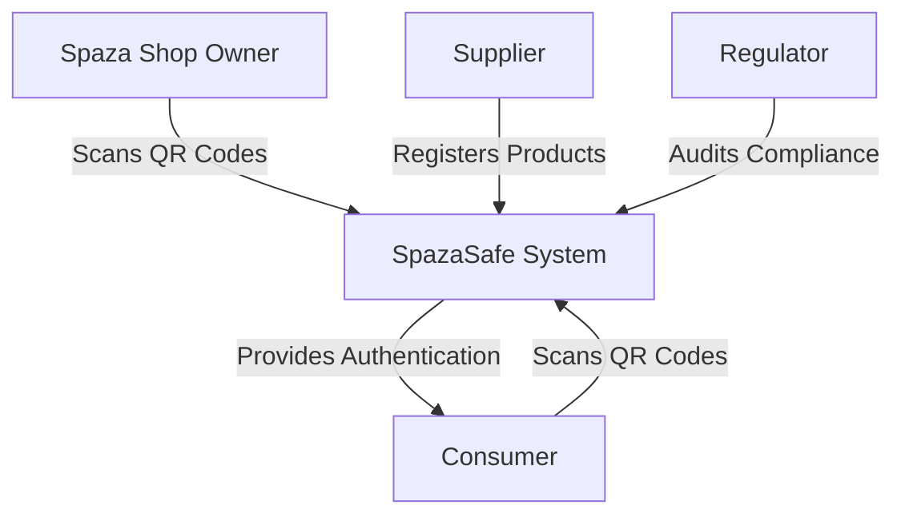
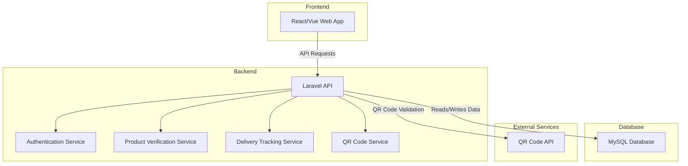
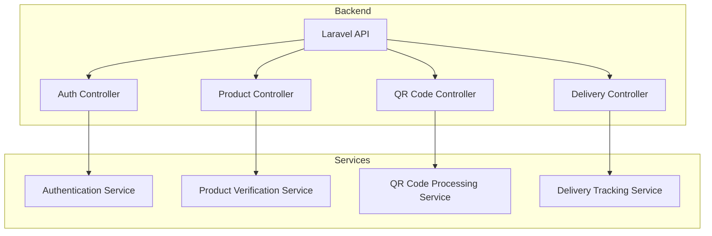
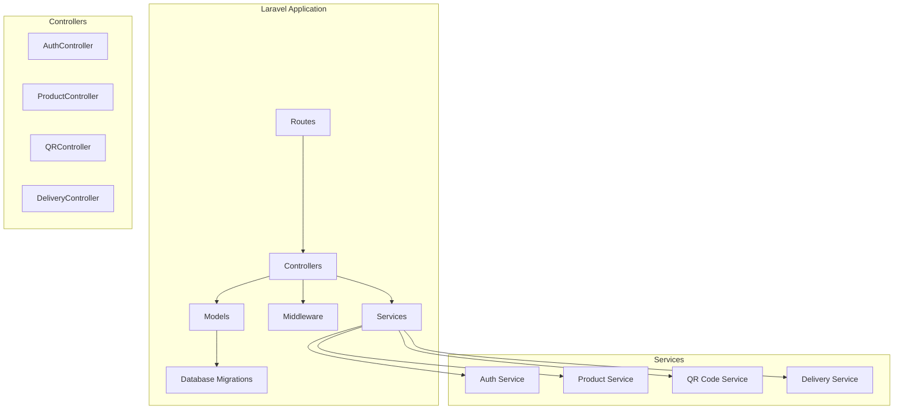

# ARCHITECTURE.md

## 1. Project Title
**SpazaSafe: Counterfeit & Expired Product Detection System**

## 2. Domain
**Informal Retail & Consumer Safety**  
SpazaSafe operates within the informal retail sector, aiming to enhance product authenticity and safety in Spaza shops across South Africa. The system integrates QR codes, suppliers, shop owners, and regulatory bodies to ensure safe and legitimate products are sold.

## 3. Problem Statement
Spaza shops often sell expired or counterfeit products due to weak supply chain transparency. Consumers face health risks, and legitimate suppliers lose revenue. SpazaSafe addresses this issue by providing QR-based product authentication, supplier verification, and regulatory tracking.

## 4. C4 Architectural Diagrams

### 4.1 Context Diagram
Illustrates how SpazaSafe interacts with different users and external systems.

### 4.2 Container Diagram
Breaks the system into major components (backend, frontend, database, integrations).

### 4.3 Component Diagram
Details key components within the system.

### 4.4 Code Diagram (Level 4 - Code Structure)
Defines high-level structure for Laravel application.

---
