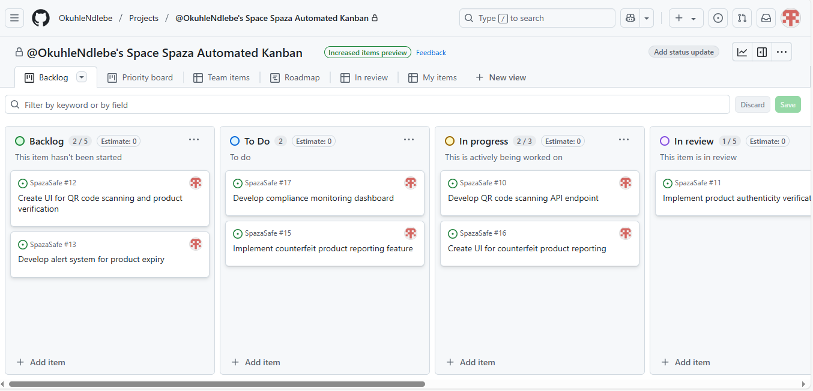
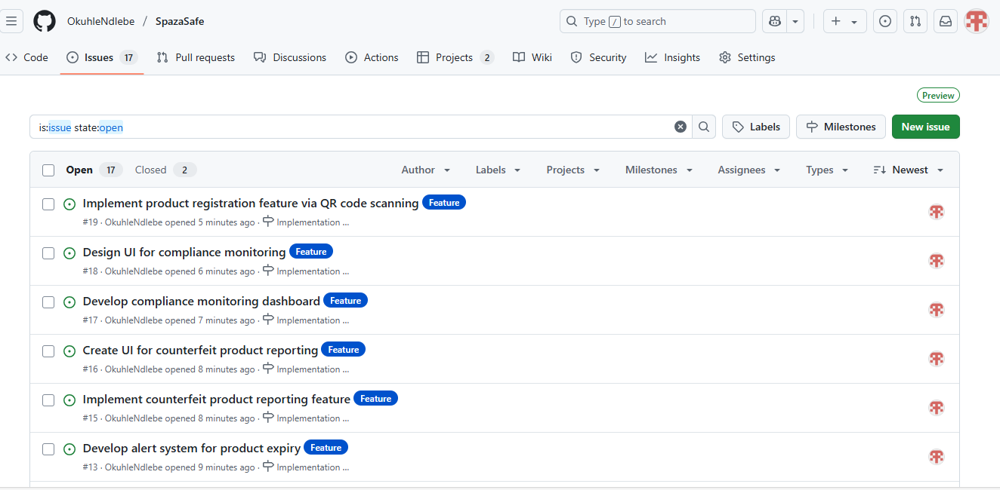

# Custom Kanban Board Customization

## Custom Columns
- **To Do**
- **In Progress**
- **In Review**
- **Testing**: Added to align with QA requirements and ensure thorough testing of features before they are marked as done.
- **Blocked**: Added to identify tasks that are currently blocked due to dependencies or other issues, allowing the team to address these blockers promptly.
- **Done**

## Task Assignments and Statuses
Each task from the sprint plan has been assigned to team members using @mentions and placed in the appropriate column based on its current status. This ensures clear visibility and accountability for all tasks in the sprint.

## Linked Issues
Issues have been created for each user story and task, and linked to the Kanban board. Labels such as "feature" have been added to categorize the tasks and facilitate better tracking and reporting.

### Example of Task Assignments and Statuses

| Task ID | Task Description | Assigned To | Status         | Labels   |
|---------|------------------|-------------|----------------|----------|
| T-001   | Develop QR code scanning API endpoint | @DevTeam   | In Progress  | feature  |
| T-002   | Implement product authenticity verification logic | @DevTeam   | To Do         | feature  |
| T-003   | Create UI for QR code scanning and product verification | @FrontendTeam | In Review    | feature  |
| T-004   | Develop alert system for product expiry | @DevTeam   | To Do         | feature  |
| T-005   | Design UI for alert notifications | @FrontendTeam | To Do         | feature  |
| T-006   | Implement counterfeit product reporting feature | @DevTeam   | To Do         | feature  |
| T-007   | Create UI for counterfeit product reporting | @FrontendTeam | Testing      | feature  |
| T-008   | Develop compliance monitoring dashboard | @DevTeam   | Blocked       | feature  |
| T-009   | Design UI for compliance monitoring | @FrontendTeam | To Do         | feature  |
| T-010   | Implement product registration feature via QR code scanning | @DevTeam   | To Do         | feature  |
| T-011   | Create UI for product registration | @FrontendTeam | To Do         | feature  |

By following these steps, you can create a customized Kanban board on GitHub to effectively manage Agile workflows and track the progress of your project.

### Screenshot of Customized Kanban Board

## Conclusion
This customized Kanban board facilitates the effective tracking and management of tasks, ensuring clear visibility and accountability for all team members. The addition of the "Testing" and "Blocked" columns helps in aligning with QA requirements and addressing blockers promptly, thereby improving the overall efficiency of the project management process.
