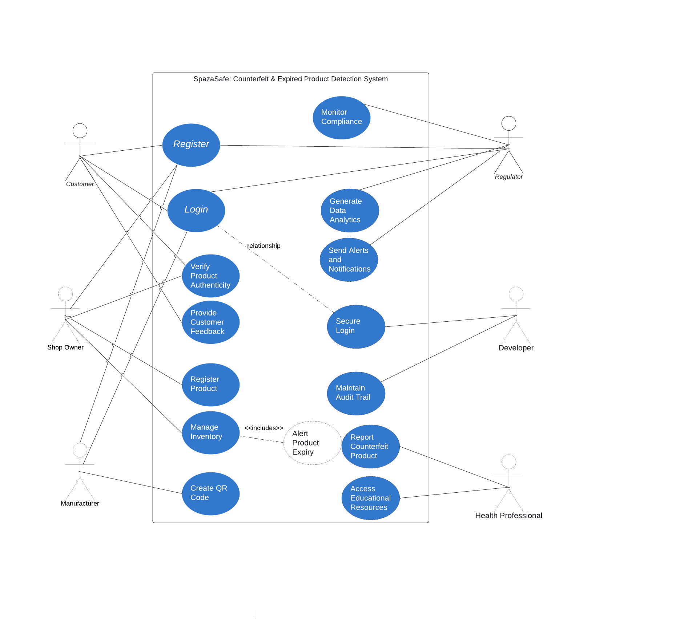

# Use Case Diagram

## Key Actors and Their Roles

### 1. Customer
**Role**: The customer uses the system to verify the authenticity of products and provide feedback on product quality.

**Activities**:
- Scanning QR codes on products to check their authenticity.
- Providing feedback on the quality of products via their smartphones.
- Accessing educational resources about counterfeit products.

### 2. Shop Owner
**Role**: The shop owner manages the inventory, verifies product authenticity, and receives alerts about product expiry.

**Activities**:
- Scanning QR codes to verify product authenticity.
- Registering new products into the inventory by scanning QR codes.
- Managing inventory levels, tracking sales, and monitoring expired products.
- Receiving alerts about upcoming product expiry dates.

### 3. Manufacturer
**Role**: The manufacturer creates QR codes for products to ensure their authenticity.

**Activities**:
- Generating QR codes for product packaging.
- Ensuring the authenticity of products supplied to shop owners.

### 4. Regulator
**Role**: The regulator monitors compliance with health regulations and generates data analytics.

**Activities**:
- Monitoring compliance of stores and manufacturers with health regulations.
- Generating data analytics on product sales and counterfeit incidents.
- Sending alerts and notifications about non-compliance and counterfeit reports.

### 5. Developer
**Role**: The developer maintains the system, ensures secure login, and maintains an audit trail of activities.

**Activities**:
- Developing and maintaining the system.
- Implementing secure login mechanisms for all user roles.
- Maintaining an audit trail of all transactions and activities.

### 6. Environmental Health Professional
**Role**: The environmental health professional reports counterfeit products and organizes community awareness programs.

**Activities**:
- Reporting counterfeit products, including product details, shop details, and photographic evidence.
- Accessing and providing educational resources about counterfeit products.
- Organizing community awareness programs on counterfeit product issues.

## Relationships Between Actors and Use Cases

- **Customer**:
  - **Verify Product Authenticity**: Customers use QR code scanners to verify if a product is genuine.
  - **Provide Customer Feedback**: Customers submit feedback on product quality, which is acknowledged within 24 hours.
  - **Access Educational Resources**: Customers access online resources about counterfeit products.
  
- **Shop Owner**:
  - **Verify Product Authenticity**: Shop owners scan QR codes to ensure products are genuine.
  - **Register Product**: Shop owners register new products into the inventory via QR codes.
  - **Manage Inventory**: Shop owners manage inventory levels, track sales, and monitor expired products.
  - **Alert Product Expiry**: Shop owners receive alerts about products nearing their expiration date.
  
- **Manufacturer**:
  - **Create QR Code**: Manufacturers create and supply QR codes for product packages to ensure authenticity.
  
- **Regulator**:
  - **Monitor Compliance**: Regulators track and monitor compliance with health regulations.
  - **Generate Data Analytics**: Regulators access and analyze data on product sales and counterfeit incidents.
  - **Send Alerts and Notifications**: Regulators send alerts and notifications regarding non-compliance and counterfeit products.
  
- **Developer**:
  - **Secure Login**: Developers ensure secure multi-factor authentication for user login.
  - **Maintain Audit Trail**: Developers maintain a detailed audit trail of system activities.
  
- **Environmental Health Professional**:
  - **Report Counterfeit Product**: Environmental health professionals report counterfeit products.
  - **Access Educational Resources**: Environmental health professionals access and disseminate educational resources.
  - **Organize Community Awareness Programs**: Environmental health professionals organize programs to raise awareness about counterfeit products.

## Addressing Stakeholder Concerns

- **Customer Concerns**: 
  - The `verifyProductAuthenticity()` and `provideCustomerFeedback()` use cases ensure that customers can easily verify product authenticity and provide feedback, addressing their concern about accessing safe and authentic products.
  
- **Shop Owner Concerns**: 
  - The `alertProductExpiry()`, `registerProduct()`, and `manageInventory()` use cases help shop owners maintain product quality and manage their inventory efficiently, addressing their concerns about ensuring product authenticity and quality.
  
- **Manufacturer Concerns**: 
  - The `createQRCode()` use case allows manufacturers to protect their brand integrity by ensuring their products are not counterfeited.
  
- **Regulator Concerns**: 
  - The `monitorCompliance()`, `generateDataAnalytics()`, and `sendAlertsAndNotifications()` use cases provide regulators with the tools needed to enforce regulations and monitor compliance effectively.
  
- **Developer Concerns**: 
  - The `secureLogin()` and `maintainAuditTrail()` use cases ensure the system is secure and reliable, addressing developers' concerns about system security and maintenance.
  
- **Environmental Health Professional Concerns**: 
  - The `reportCounterfeitProduct()`, `accessEducationalResources()`, and `organizeCommunityAwarenessPrograms()` use cases help environmental health professionals identify and remove counterfeit products and educate the community, addressing their concerns about public health safety.

