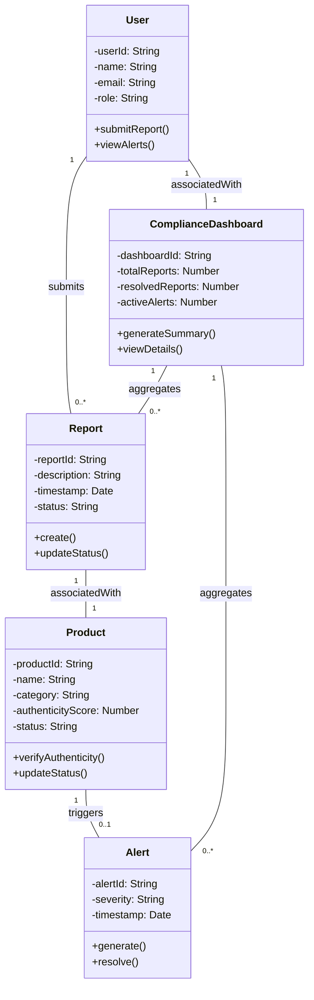

### Explanation of Key Design Decisions

1. **Classes and Attributes**:
   - The `User` class represents system users, with attributes such as `userId`, `name`, `email`, and `role`, which determine their permissions.
   - The `Product` class contains attributes like `authenticityScore` and `status` to handle counterfeit detection.
   - The `Report` class tracks user-submitted reports with details like `description` and `status`.
   - The `Alert` class is used for system-triggered notifications, with attributes like `severity` and `timestamp`.
   - The `ComplianceDashboard` class aggregates data for user analysis, such as active alerts and resolved reports.

2. **Relationships**:
   - A `User` can submit multiple `Reports` (`1` to `0..*`).
   - Each `Report` is associated with exactly one `Product` (`1` to `1`).
   - A `Product` can trigger at most one `Alert` (`1` to `0..1`).
   - Each `User` has one `ComplianceDashboard` (`1` to `1`).
   - The `ComplianceDashboard` aggregates multiple `Reports` and `Alerts` (`1` to `0..*`).

3. **Multiplicity**:
   - The multiplicity ensures a clear understanding of how many instances of one class can relate to another.

4. **Methods**:
   - Methods like `submitReport()` in `User` and `generateSummary()` in `ComplianceDashboard` reflect key functionalities of the system.

This class diagram visually represents the counterfeit system and its data-driven relationships, ensuring clarity and alignment with functional requirements.